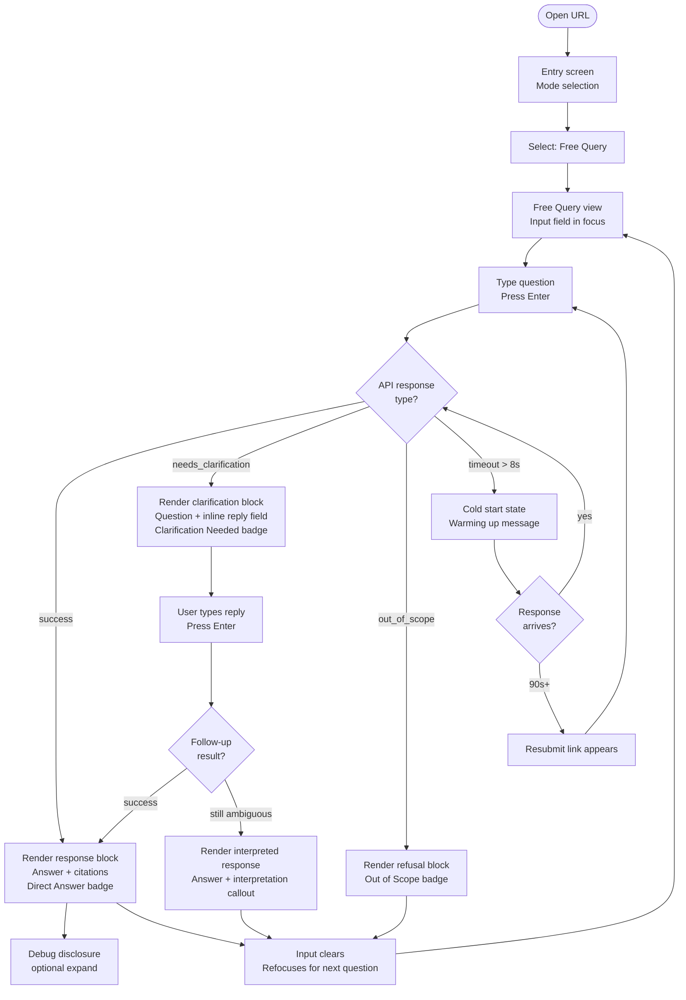
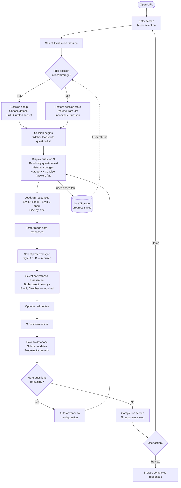

# UX Design Specification: PLC Coach Service

**Author:** Claudia
**Date:** 2026-02-27

---

## Executive Summary

### Project Vision

The PLC Coach Service test client is an internal web UI for evaluating the quality
of an AI-powered RAG API that answers educator questions from the 25-book PLC @ Work®
series. It is explicitly a testing environment — not a production product — and must
carry a prominent, context-aware disclaimer at all times. The UI serves two distinct
modes: Free Query (ad-hoc API testing) and Evaluation Session (structured A/B style
preference collection through the golden dataset).

### Target Users

Internal testers across three profiles:
- **Developers** — technically fluent, focused on correctness and API behavior
- **Leadership** — non-technical, need clarity and polish to assess product quality
- **Press team members** — non-technical, evaluating answer style and tone

The mixed audience means the UI must feel clean and professional enough for
non-technical stakeholders while exposing enough detail (citations, query type,
response metadata) for developers.

### Key Design Challenges

1. **Two modes, one tool** — Free Query and Evaluation Session serve different mental
   models. The UI must separate them clearly without feeling complex.

2. **Clarification loop legibility** — The conditional flow (ambiguous query →
   clarifying question → follow-up → final answer) must feel like a natural
   conversation, not a confusing multi-step form, especially for non-technical users.

3. **Side-by-side A/B at scale** — Responses can be long. The comparison layout must
   handle lengthy Book-Faithful vs Coaching-Oriented answers without left-side
   dominance or excessive scrolling.

4. **Source citation presentation** — Citations include book title, SKU, page number,
   and a text excerpt. For developers this is raw data; for press and leadership it
   should read as credible, book-like references.

### Design Opportunities

1. **Session setup flow** — A lightweight pre-evaluation step (choose full dataset or
   curated subset) gives non-technical users immediate context and purpose before
   they see their first question.

2. **Progress as motivation** — A "question X of Y" indicator with a clear ✓ done
   state per question gives all users a sense of progress and completion.

3. **Context-aware testing banner** — Adapting the disclaimer to the active mode
   ("Free Query Mode — responses are for testing only" vs "Evaluation Session — your
   preferences are being recorded") builds transparency and trust with non-technical
   users.

4. **Citation as trust signal** — Styling citations as book references (not raw
   metadata) reinforces the product's core value proposition even in a testing context.

---

## Core User Experience

### Defining Experience

The core loop is: **submit a query → receive a legible response → know what to do next.**

This loop must work flawlessly across all four response types (direct answer,
clarification needed, out-of-scope, metadata-filtered) and for all three user
profiles without any coaching. A developer and a press team member should both
be able to complete a query cycle on their first attempt with zero instructions.

The two modes — Free Query and Evaluation Session — are distinct entry points
into this same core loop, with Evaluation Session adding a structured layer
(session setup, progress tracking, A/B comparison, preference logging) on top
of the base interaction.

### Platform Strategy

- **Primary platform:** Web browser (desktop-first)
- **Responsive:** Yes — layouts must adapt gracefully to tablet and mobile,
  though the primary use case is desktop evaluation sessions
- **Access:** Open URL, no authentication required beyond the internal network
- **Styling:** Greenfield — no existing design system or brand constraints.
  Visual language should feel clean, professional, and tool-like (not consumer
  app, not raw developer dashboard)
- **Input:** Keyboard-primary; mouse/click for preference selection and navigation

### Effortless Interactions

1. **Query submission** — Type and press Enter. No buttons to find, no forms to
   fill. The input field is always the focal point.

2. **Mode switching** — Free Query vs Evaluation Session is a clear choice on
   entry, never ambiguous mid-session.

3. **Preference logging** — In A/B evaluation, selecting a preferred style is
   one click. Notes are optional and non-blocking. The session automatically
   advances to the next question after logging.

4. **Clarification loop** — When the system asks a clarifying question, the UI
   visually signals "the system needs more from you" — not an error, not a
   failure. The reply field appears inline, continuing the thread naturally.

5. **Citation reading** — Source citations render as readable book references
   (title, page, excerpt) not raw JSON fields. Non-technical users can scan
   them without friction.

### Critical Success Moments

1. **First answer lands** — The user submits their first query and receives a
   grounded, cited answer. This is the moment they believe the product works.
   It must be fast to read, visually clear, and credibly sourced.

2. **Clarification loop resolves** — An ambiguous query triggers a clarifying
   question. The user responds, and the system answers. If this feels like a
   natural back-and-forth rather than a broken interaction, the experience wins.

3. **A/B preference captured** — The user reads both style responses, picks one,
   and the session moves forward. If this feels effortless and the progress
   indicator advances, the evaluator feels productive.

4. **Evaluation session complete** — The user reaches the end of their question
   set and sees a clear completion state. For non-technical users especially,
   knowing their work was saved and is done matters.

### Experience Principles

1. **Legibility over cleverness** — Every response state, every status, every
   action must be instantly understood without explanation. Non-technical users
   are the design constraint.

2. **Structured freedom** — Two clearly separated modes. Within each mode,
   one obvious path forward at all times.

3. **Low friction for repeated actions** — Evaluators do this dozens of times
   per session. Every unnecessary click or cognitive load compounds into
   fatigue. Strip it down.

4. **Transparency builds trust** — The testing banner, citation display, session
   context, and mode labels all signal honesty about what the tool is and what
   the user is participating in. This matters especially for leadership and press.

---

## Desired Emotional Response

### Primary Emotional Goals

- **Confidence** — Users trust that the system is working correctly, that their
  evaluation is meaningful, and that what they're seeing reflects the real
  product capability.
- **Productivity** — Users move through their work with purpose. Sessions have
  a clear structure, actions require minimal effort, and progress is visible.
- **Trust** — Citations, response quality, and interface honesty signal that
  this tool and the underlying service are credible and serious.

### Emotional Journey Mapping

| Stage | Desired Feeling | Design Response |
|---|---|---|
| **First arrival** | Oriented, not overwhelmed | Clear mode choice on entry; context-aware banner immediately sets expectations |
| **First query** | Curious → Validated | Clean input focus; response arrives with readable citations that feel credible |
| **Clarification loop** | Understood, not confused | Inline reply thread; clear "the system needs more from you" signal |
| **A/B comparison** | Focused, calm | Equal-weight side-by-side layout; no urgency, no visual noise |
| **Preference logged** | Accomplished, progressing | Subtle confirmation + auto-advance; progress indicator ticks forward |
| **Session complete** | Done, confident | Clear completion state; reassurance that preferences were saved |
| **Something goes wrong** | Informed, not alarmed | Plain-language error messages; no technical jargon for non-technical users |

### Micro-Emotions

| Emotion to Cultivate | Emotion to Avoid |
|---|---|
| Confidence | Skepticism |
| Calm focus | Anxiety or urgency |
| Productive momentum | Fatigue or frustration |
| Trust in results | Confusion about what happened |
| Quiet accomplishment | Over-excitement or distraction |

### Design Implications

1. **Confidence → Citation design** — Citations render as formatted book
   references with clear provenance (title, page, excerpt). Nothing looks
   like raw API output. Non-technical users should be able to verify a source
   as easily as checking a footnote.

2. **Productivity → Auto-advance + progress tracking** — After logging a
   preference, the session moves forward automatically. The progress bar
   ("7 of 50") is always visible in Evaluation Mode. Completed questions
   get a quiet ✓, not a celebration.

3. **Trust → Honest framing everywhere** — The testing banner, mode labels,
   and session context copy all use plain, accurate language. No marketing
   tone. The UI never oversells what the tool is.

4. **Calm focus → Visual restraint** — Neutral color palette, generous
   whitespace, no animations beyond functional feedback (loading state,
   inline reply appearance). The A/B comparison panel is balanced and quiet
   — no visual weight favoring either style.

5. **Informed on errors → Plain-language states** — Out-of-scope responses,
   expired sessions, and API errors all use human-readable messages. Error
   states never show raw HTTP codes or stack traces to non-technical users.

### Emotional Design Principles

1. **Calm is a feature** — This is a professional evaluation tool, not a
   consumer app. Restraint in animation, color, and copy signals seriousness
   and builds confidence in the results.

2. **Honesty over polish** — Transparency about what the tool is (a testing
   environment), what mode the user is in, and what the system is doing
   matters more than visual flair.

3. **Quiet progress over celebration** — Accomplishment is conveyed through
   forward movement and completion states, not congratulatory messages or
   animations.

4. **Never leave the user guessing** — Every state — loading, clarification
   needed, out-of-scope, error — has a clear, calm explanation. Confusion is
   the one emotion the UI must actively prevent.

---

## UX Pattern Analysis & Inspiration

### Inspiring Products Analysis

**Notion**
- **What it does well:** Document-like structure where content is the UI —
  no chrome overhead, generous whitespace, clean typographic hierarchy.
  Non-technical users trust it immediately because it feels like a familiar
  document, not a software tool.
- **Key pattern:** Citations and references feel natural when presented in
  a document format. A footnote-style book reference (title, page, excerpt)
  maps directly to how Notion surfaces linked references.
- **Emotional alignment:** Calm, focused, oriented — exactly the emotional
  goals for this tool.

**Claude**
- **What it does well:** The conversation thread is the UI. Clarifying
  questions appear inline as a natural continuation of the exchange — not
  as a separate form, modal, or error state. Response blocks are distinct,
  scannable, and well-formatted. The input field is always anchored and
  always the focal point.
- **Key pattern:** The inline clarification loop. When Claude needs more
  information, the reply field appears in context — the user never leaves
  the thread or navigates elsewhere. This is exactly the pattern needed
  for the conditional clarification flow.
- **Emotional alignment:** The user feels understood and guided, not
  interrupted or confused.

**GitHub PR Review**
- **What it does well:** Side-by-side comparison is a proven, trusted
  pattern for structured evaluation by professional users. Inline comment
  fields per item, clear status indicators (approved ✓, changes requested),
  and progress through a list (files → questions) map naturally to the
  evaluation session flow.
- **Key pattern:** The review sidebar — a list of items (files/questions)
  with status indicators — gives users constant orientation within a
  structured session. Completed items are visually distinct from pending.
- **Emotional alignment:** Professional, productive, progress-oriented.

### Transferable UX Patterns

**Layout & Structure**
- **Notion → Document-style response layout** — Responses render as clean,
  typographically structured content blocks, not chat bubbles. Citations
  appear as formatted footnotes below the answer.
- **GitHub → Evaluation sidebar** — In Evaluation Session mode, a left
  sidebar lists all questions in the set with status indicators (pending /
  in progress / complete ✓). Clicking a question navigates directly to it.

**Interaction Patterns**
- **Claude → Inline clarification thread** — When `needs_clarification`
  fires, the reply input appears directly below the clarifying question,
  continuing the thread. No modals, no page transitions.
- **GitHub → One-click status + optional notes** — Preference selection
  mirrors the PR review approve/request-changes pattern: one click to log
  preference, an optional inline notes field that doesn't block progression.
- **GitHub → Auto-advance after action** — After logging a preference,
  the session advances to the next question automatically, with the sidebar
  updating to reflect completion.

**Visual Patterns**
- **Notion → Neutral palette, whitespace-first** — Off-white background,
  dark neutral text, minimal use of color. Color is reserved for functional
  signals (status chips, loading state) not decoration.
- **GitHub → Status chips** — Small, clear badges for response type
  (Direct Answer, Clarification Needed, Out of Scope) mirror GitHub's
  label system — functional, scannable, not intrusive.

### PRD Alignment Findings (Party Mode Review)

The following gaps were identified by reviewing the full PRD against the UX
design and resolved during this step:

**Preference Log — Complete Field Set (Section 2.3, Track B)**
The structured preference log requires these fields per evaluation question:
- Query text — displayed from golden dataset (read-only)
- Query category (simple fact / complex synthesis / ambiguous) — pre-tagged
  metadata badge, display only
- Concise Answers FAQ mapping — pre-tagged boolean badge, display only
- Style A response — Book-Faithful (displayed in left panel)
- Style B response — Coaching-Oriented (displayed in right panel)
- **Preferred style** — required, one-click selection (A or B)
- **Correctness assessment** — required, 4-option selection (both correct /
  A only / B only / neither)
- **Optional tester notes** — free text, non-blocking

**Resumable Evaluation Sessions**
Best practice for annotation/evaluation tasks is session resumption.
Tester progress is saved per-question to the database automatically.
Returning testers resume from their last incomplete question. A persistent
"Progress auto-saved" indicator in the session header removes anxiety
about losing work.

**Interpreted Response State (AC #8)**
When a follow-up query remains ambiguous, the API returns `success` with
a best-interpretation answer. The UI renders a distinct informational
callout within the response block:
*"The system interpreted your question as: [interpretation]. If this isn't
what you meant, please ask again."* Styled as a calm informational note,
not a warning or error.

**Mode-Specific Response Layout**
- **Evaluation Session mode** — Response blocks include metadata badges
  (query category, Concise Answers flag) pre-populated from the golden
  dataset.
- **Free Query mode** — Response blocks render without metadata badges.
  Same component, metadata row conditionally absent.

**API Key Handling**
The static `X-API-Key` is hardcoded in the client's environment config,
never surfaced in the UI. Accepted MVP security tradeoff: internal-only
access limits exposure risk, but key rotation requires redeployment.
Flagged for post-MVP improvement.

**Developer Debug Affordance**
A collapsed "Debug info" disclosure at the bottom of every response block.
Hidden by default — one click to expand. Surfaces: `conversation_id`,
`session_id` (if applicable), response type, and timestamp. Invisible to
non-technical users; accessible to developers for CloudWatch correlation.

**Session Expiry Recovery (400 Error)**
When a Redis clarification session expires, the UI displays:
- Plain-language message: *"Your session timed out. Please resubmit your
  original question."*
- A **"Resubmit question"** button that re-populates the input field with
  the original query text. One-click recovery, no copy-pasting required.

### Anti-Patterns to Avoid

1. **Chat bubble UI (ChatGPT-style)** — Creates the wrong mental model.
   Document-style blocks (Notion) are more appropriate for an evaluation
   instrument.
2. **Dashboard overload** — Too many panels, metrics, or widgets. Every
   element must earn its place.
3. **Hidden citations** — Collapsing source citations behind an accordion
   buries the most important trust signal. Visible by default.
4. **Celebration animations on completion** — Conflicts with calm,
   professional tone. Completion states should be clear and quiet.
5. **Raw API field labels** — Field names like `status`, `conversation_id`,
   or `chunk_type` must never appear in the UI for non-technical users.

### Design Inspiration Strategy

**Adopt directly:**
- Notion's document layout and typographic hierarchy for response display
- Claude's inline clarification reply pattern
- GitHub's sidebar question list with status indicators
- GitHub's one-click action + optional notes for preference logging

**Adapt for this context:**
- GitHub's side-by-side diff → equal-weight A/B response panels,
  scrollable independently, no left-side dominance
- Notion's page structure → two-panel layout: persistent sidebar
  (session progress) + main content area (query + response)

**Avoid entirely:**
- Chat bubble interaction model
- Accordion-hidden citations
- Gamification or completion celebrations
- Any raw API/technical vocabulary surfaced to end users

---

## Design System Foundation

### Design System Choice

**Tailwind CSS + shadcn/ui** (built on Radix UI primitives)
**Framework:** Next.js App Router (static export)
**Deployment:** Amazon S3 + CloudFront

A themeable, composable component system with headless accessibility
primitives and a neutral design language. Components are copied directly
into the codebase — no dependency lock-in, full modification control.

### Rationale for Selection

1. **Matches the target aesthetic out of the box** — shadcn/ui's default
   neutral palette, generous whitespace, and clean typography align directly
   with the Notion-inspired visual language. Minimal overrides needed to hit
   the calm, professional tool feel.

2. **Greenfield-friendly** — No existing brand constraints means Tailwind's
   utility-first approach is an advantage. Design tokens defined once in
   `tailwind.config.ts` propagate everywhere.

3. **Covers all required components** — shadcn/ui ships with every component
   the test client needs: input fields, badges/chips, sidebars, collapsibles
   (debug panel), progress indicators, toasts, and scroll areas.

4. **Accessibility built in** — Radix UI primitives handle focus management,
   keyboard navigation, and ARIA attributes. Critical for non-technical users
   and essential groundwork for the future Section 508 compliance requirement
   noted in the PRD.

5. **No dependency lock-in** — Components live in the codebase. The team
   owns them entirely.

6. **Static export fits S3 + CloudFront deployment** — Next.js App Router
   with `output: 'export'` produces a fully static build. Deployment is:
   `next build` → sync to S3 → CloudFront invalidation. Zero server runtime.

### Implementation Approach

- **Framework:** Next.js App Router with `output: 'export'` in
  `next.config.ts` — fully client-rendered, no server components at runtime
- **Routing:** Two top-level routes — `/` (Free Query mode) and `/session`
  (Evaluation Session mode). Client-side navigation only.
- **State management:** Zustand — lightweight session state with localStorage
  persistence for resumable evaluation sessions
- **Design tokens** defined in `tailwind.config.ts`: neutral gray scale,
  semantic colors, spacing scale, and typography
- **Font:** Inter via `next/font/google` (self-hosted) — no external CDN
  dependency, safe for private/restricted network environments
- **CSS variables** for theming — enables future dark mode without component
  rewrites
- **API key:** `NEXT_PUBLIC_API_KEY` in environment config — client-visible
  in static bundle. Accepted MVP security tradeoff; document explicitly.

### Deployment Architecture

| Concern | Decision |
|---|---|
| **Build output** | `next export` → static files in `/out` |
| **Hosting** | Private S3 bucket (no direct public access) |
| **CDN** | CloudFront distribution with S3 origin access control |
| **Routing** | CloudFront custom error: 404 → `index.html` (client-side routing) |
| **CI/CD** | GitHub Actions: build → S3 sync → CloudFront invalidation |
| **Network access** | CloudFront WAF or geo-restriction for internal-only access |

### Customization Strategy

| Element | Approach |
|---|---|
| **Color palette** | Neutral grays base; single accent for interactive states. No decorative color. |
| **Typography** | Inter (self-hosted via `next/font`). Monospace for debug fields only. |
| **Response blocks** | Custom component extending shadcn/ui Card — document-style |
| **Citation display** | Custom footnote-style component: title (bold), page, excerpt (muted) |
| **A/B comparison panel** | Custom two-column layout, equal-width, independent scroll, preference form below. **Spike this component first.** |
| **Evaluation sidebar** | shadcn/ui ScrollArea + custom question list with status badges |
| **Debug disclosure** | shadcn/ui Collapsible — hidden by default, monospace content |
| **Testing banner** | Custom sticky header — context-aware copy, understated but unmissable |
| **Session persistence** | Zustand store → localStorage for cross-session resumption |

---

## Defining Core Experience

### Defining Experience

> **"Ask a PLC question, get a grounded answer with real book citations —
> instantly legible, instantly trustworthy."**

The moment a tester types a question, presses Enter, and sees a formatted
answer with a specific book title, page number, and verifiable excerpt is
the moment they stop being skeptical and start being convinced — by the
tool and by the service it evaluates. Everything else in the UI exists to
support or protect this moment.

### User Mental Model

**Current state — Postman:**
Testers are currently using Postman to query the API. This requires:
manually formatting a JSON request body, setting the `X-API-Key` header,
submitting the request, parsing raw JSON to read the answer, manually
extracting citation fields, and constructing a follow-up request with the
correct `session_id` for clarification loops. For developers this is
workable but slow. For leadership and press it is a non-starter.

**Expected mental model — the test client:**
Users arrive expecting something closer to a search or chat interface —
type a question, read an answer. The UI meets this expectation exactly,
then exceeds it by presenting citations as readable book references rather
than raw JSON fields. The clarification loop, out-of-scope refusal, and
metadata-filtered responses all feel like natural extensions of the same
simple mental model: ask → receive.

**Where Postman fails that the UI fixes:**

| Postman friction | UI solution |
|---|---|
| Manual JSON body construction | Plain text input field, Enter to submit |
| Raw JSON response parsing | Formatted response block with readable typography |
| Citation fields as raw strings | Footnote-style citation component |
| Manual `session_id` management for clarification | Inline reply thread, session handled automatically |
| No structured evaluation workflow | Evaluation Session mode with progress, A/B panels, preference logging |
| Unusable by non-technical users | Accessible to developers, leadership, and press alike |

### Success Criteria

The defining experience succeeds when:

1. **Zero setup** — A tester opens the URL and submits their first query
   within 60 seconds, with no instructions needed.

2. **Response is immediately readable** — Answer text, citation block, and
   response type (direct / clarification / out-of-scope) are all legible
   without scanning or parsing.

3. **Citations feel verifiable** — A non-technical user can look at a
   citation and understand: what book it came from, what page, and what
   the relevant passage says. No training required.

4. **Clarification loop feels conversational** — When the system asks a
   clarifying question, the tester replies naturally in the same view.
   It feels like a follow-up, not a new form.

5. **The evaluation unit feels complete** — In Evaluation Session mode,
   after reading both A/B responses and logging a preference and
   correctness assessment, the tester feels they have done their job
   fully and correctly.

### Novel vs. Established Patterns

**Established patterns used:**
- Text input + Enter to submit (universal)
- Inline conversational thread for clarification (Claude, iMessage)
- Document-style response blocks (Notion, email)
- Sidebar progress list with status indicators (GitHub PR review)
- Side-by-side comparison (GitHub diff, document review tools)

**Novel combination:**
The UI combines a conversational query interface (familiar from chat tools)
with a structured evaluation instrument (familiar from annotation/review
tools) in a single unified surface. The mode selector on entry is what
makes this legible: it tells users which context they're in before they
see the first interaction. No user education required — every individual
pattern is borrowed from tools users already know.

### Experience Mechanics

**Free Query Mode — Core Loop:**

1. **Initiation** — User arrives at `/`. Testing banner visible. Single
   input field in focus. Placeholder: *"Ask a PLC question..."*
2. **Interaction** — User types a question and presses Enter. Input shows
   loading state. Subtle shimmer on the response area.
3. **Feedback (success)** — Response block appears: formatted answer +
   citation footnotes. Response type badge shown quietly. Input clears
   and refocuses.
4. **Feedback (clarification needed)** — Response block shows the
   clarifying question. Inline reply input appears immediately below.
   Badge: "Clarification Needed." User replies → resolution appears.
5. **Feedback (out-of-scope)** — Plain-language refusal. Badge: "Out of
   Scope." Input refocuses for next question.
6. **Feedback (interpreted response)** — Answer with informational
   callout: *"Interpreted as: [X]. Ask again if this wasn't what you
   meant."*

**Evaluation Session Mode — Core Loop:**

1. **Initiation** — User selects "Evaluation Session." Setup screen:
   choose full dataset or curated subset → Start Session. Sidebar loads
   with question list and status indicators.
2. **Interaction** — First question displayed automatically. Metadata
   badges shown (query category, Concise Answers flag). Two response
   panels (Style A / Style B) load side-by-side.
3. **Evaluation form** — Below panels: preferred style (A/B, required) +
   correctness assessment (4-option, required) + optional notes.
4. **Feedback** — Quiet confirmation on submit, sidebar ✓ updates,
   auto-advance to next question. Progress indicator increments.
   "Progress auto-saved" visible in header.
5. **Session expiry** — Plain-language message + "Resubmit question"
   button restoring original query text.
6. **Completion** — "Session complete. Your [N] responses have been
   saved." Quiet. Option to review or return home.
7. **Resumption** — Returning tester's Zustand state restored from
   localStorage. Resumes from first incomplete question automatically.

---

## Visual Design Foundation

### Color System

Neutral-first palette. One accent color for interactive states — nothing
decorative. All colors use Tailwind CSS variables defined in
`tailwind.config.ts` and mapped to shadcn/ui CSS custom properties.

| Role | Tailwind Token | Hex | Usage |
|---|---|---|---|
| Background | `zinc-50` | #fafafa | Page background |
| Surface | `white` | #ffffff | Cards, response blocks, panels |
| Border | `zinc-200` | #e4e4e7 | Dividers, card borders |
| Text primary | `zinc-900` | #18181b | Body text, headings |
| Text muted | `zinc-500` | #71717a | Citations, metadata, labels |
| Accent | `indigo-600` | #4f46e5 | Links, focus rings, active states, progress |
| Success | `emerald-600` | #059669 | ✓ Completion states, done badges |
| Warning | `amber-600` | #d97706 | Clarification Needed badge |
| Destructive | `red-600` | #dc2626 | Out of Scope badge, error messages |
| Info | `blue-600` | #2563eb | Interpreted response callout |

**Accessibility:** All foreground/background pairings meet WCAG AA contrast
(4.5:1 minimum). Color is never the sole indicator of state — badges always
include a text label.

### Typography System

**Typeface:** Inter (self-hosted via `next/font/google` — no external CDN).

| Scale | Size | Line Height | Weight | Usage |
|---|---|---|---|---|
| Display | 24px | 32px | 600 | Page titles, mode headings |
| Heading | 18px | 28px | 600 | Response block headers, section titles |
| Body | 15px | 24px | 400 | Answer text, question text, form labels |
| Small | 13px | 20px | 400 | Citation text, metadata badges, helper text |
| Mono | 13px | 20px | 400 | Debug info, `conversation_id`, technical IDs |

**Readability rules:**
- Maximum line length: 72ch for answer body text
- A/B panel body text: 65ch max per column
- Citation excerpts: italic, `zinc-500`, 13px — distinct from answer text

### Spacing & Layout Foundation

**Base unit:** 8px. All spacing values are multiples of 8px.

**Two-panel layout:**
```
┌─────────────────────────────────────────────────────┐
│  Testing Banner (sticky, 48px)                      │
├────────────┬────────────────────────────────────────┤
│  Sidebar   │  Main content area                     │
│  280px     │  fluid                                 │
│  (eval     │                                        │
│  mode      ├────────────────────────────────────────┤
│  only)     │  Input area (pinned bottom, Free Query)│
└────────────┴────────────────────────────────────────┘
```

**Spacing tokens:**
- Component padding: 24px
- Section gap: 32px
- Inline element gap: 8px
- A/B panel column gap: 24px
- Sidebar item padding: 12px 16px

**Responsive behavior:**
- Below 1024px: sidebar collapses to top drawer (evaluation mode)
- Below 768px: A/B panels stack vertically (full-width each)
- Input area always full-width regardless of breakpoint

### Loading & Cold Start States

**Standard loading (< 5s expected):**
Subtle shimmer animation on the response area. Input disabled. No text.

**Cold start loading (up to 120s, NFR-009):**
After 8 seconds with no response, shimmer is supplemented with a calm
status message:
- 8s: *"The service is warming up — this may take up to a minute on first
  use. Your question hasn't been lost."*
- 30s: *"Still warming up. Almost there."*
- 60s: *"Taking longer than usual. If this continues, try resubmitting."*
- 90s: Resubmit link appears.

### Accessibility Considerations

- **Color contrast:** All text meets WCAG AA (4.5:1 minimum)
- **Focus management:** Radix UI primitives handle focus trapping and
  keyboard navigation across all interactive components
- **Screen reader labels:** All icon-only buttons have `aria-label`.
  Response type badges have `role="status"`
- **Keyboard navigation:** Full keyboard support — Enter to submit, arrow
  keys for preference selection, Tab through question list
- **Future Section 508:** This foundation (semantic HTML, Radix primitives,
  WCAG AA contrast) is the correct groundwork for full compliance when
  the PRD's future Section 508 requirement is activated

---

## Design Direction Decision

### Design Directions Explored

Three directions were generated and are available for review in the
interactive HTML showcase at:
`_bmad-output/planning-artifacts/ux-design-directions.html`

- **Direction A — Minimal Document:** Notion-inspired. Centered layout,
  generous whitespace, document-style response blocks. Sidebar appears
  only in Evaluation mode. Calm and focused.
- **Direction B — Tool Panel:** GitHub-inspired. Left rail navigation
  always visible. Input pinned to bottom. Compact density with query
  history in sidebar. Feels like a developer tool.
- **Direction C — Evaluation Focus:** Purpose-built for evaluation.
  Question bar at top, A/B panels below, evaluation form docked to bottom.
  Most structured layout.

The showcase also includes all response states: cold start loading,
clarification loop, out-of-scope, interpreted response, session expiry
recovery, and session completion.

### Chosen Direction

**⏳ DEFERRED — pending review of the HTML showcase.**

Review `_bmad-output/planning-artifacts/ux-design-directions.html`
and return to this decision before implementation begins.

### Design Rationale

To be completed after direction selection.

### Implementation Approach

To be completed after direction selection. Core components (response
blocks, citation display, A/B panels, evaluation form, sidebar) are
direction-agnostic and can be built while the layout decision is pending.

---

## User Journey Flows

### Journey A — Internal Tester: Free Query

User arrives, selects Free Query mode, submits a PLC question, and reads
a grounded response with citations. Covers all four API response types.



### Journey C — Evaluator: Evaluation Session (Phase 3 Track B)

Evaluator sets up a session, works through questions recording style
preference and correctness assessment per question. Resumable across sittings.



### Journey Patterns

**Entry pattern — mode gate:** Every session begins with an explicit mode
selection. Neither mode is the default. Users always declare intent first.

**Response rendering pattern:** All API responses use the same response
block component — variable badge, variable content, optional citations.
Users develop a reliable mental model after one or two queries.

**Recovery pattern:** Every error state includes a clear recovery action.
No error state is a dead end.

**Progress pattern:** In Evaluation Session mode, progress is visible at
all times — sidebar status + progress bar + "N of M" banner label.

**Persistence pattern:** Evaluation state is written to localStorage on
every submission. Return visitors are restored to their last position
automatically.

### Flow Optimization Principles

1. **Zero steps to first query** — Free Query: arrive → type → submit.
   No setup, no configuration, no onboarding.

2. **One decision at a time** — Clarification presents one question and
   waits. Evaluation form presents required fields before optional.

3. **Auto-advance reduces fatigue** — After each evaluation submission,
   the session moves forward automatically. Eliminates 50 unnecessary
   navigation clicks across a 50-question session.

4. **Errors inform and recover** — Every failure names the problem and
   offers the next action. Non-technical users are never stranded.

5. **Progress always visible** — Sidebar, banner, and progress bar
   provide three layers of orientation in evaluation mode.
