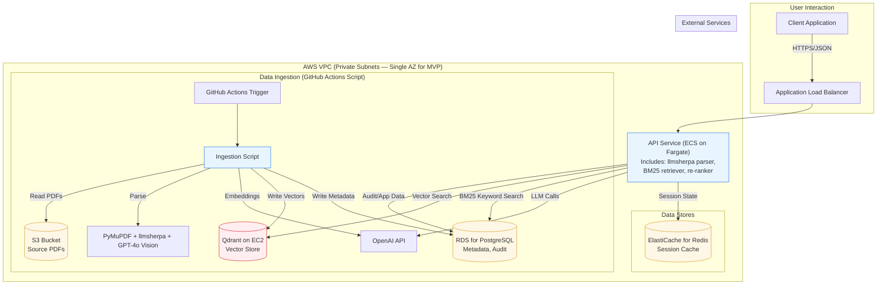

# PLC Coach Service: MVP Architecture & Engineering Plan

**Objective:** This document outlines the proposed technical architecture, technology stack, and DevOps plan for the Minimum Viable Product (MVP) of the PLC Coach service. It is intended for review by senior engineering staff to solicit feedback, identify potential risks, and ensure alignment with best practices before development begins.

**Author:** Vanes
**Date:** February 25, 2026

---

## 1. Project Context & Strategic Vision

The **PLC Coach Service** is a Retrieval-Augmented Generation (RAG) system designed to provide educators with expert, actionable answers grounded in the canonical Professional Learning Communities (PLC) literature. The core business problem is that educators lack the time to efficiently find specific guidance within a large corpus of dense, proprietary books.

The **MVP** is tightly scoped to validate a single hypothesis: that a high-quality, book-only RAG service can provide more utility and accuracy than a general-purpose LLM, thereby establishing a foundation of trust and value with users.

The **long-term vision**, however, is to evolve this service into a comprehensive, multi-tenant coaching platform that securely ingests and processes sensitive educational records, such as PLC meeting transcripts containing student-identifiable information (PII). This forward-looking requirement is the primary driver for the security-first posture and architectural decisions outlined below, even for the book-only MVP.

## 2. Core Compliance Driver: FERPA and State Law Mandates

This architecture is designed to be **compliant by default**. The service will operate as a "school official" under FERPA, which is permissible only with strict contractual and technical controls. Furthermore, the system is designed to meet the stringent requirements of state-level student privacy laws (e.g., NY Ed Law § 2-d, California's SOPIPA), which mandate specific controls beyond FERPA.

Key technical requirements derived from these laws include:

*   **Data Encryption:** All data, including student PII and proprietary book content, must be encrypted both in transit (TLS 1.2+) and at rest (KMS).
*   **Strict Access Control:** A robust Role-Based Access Control (RBAC) system is foundational.
*   **Data Minimization & Purpose Limitation:** The system must only collect, process, and retain data necessary for its specified educational purpose.
*   **Prohibition on Unauthorized Redisclosure:** Data cannot be used for secondary purposes like advertising or building profiles, and it cannot be redisclosed without authorization.
*   **Secure Data Handling:** Any vendor or sub-processor (like OpenAI) must be governed by a Data Processing Agreement (DPA) that contractually enforces these rules.

These compliance obligations dictate a hybrid infrastructure model, favoring self-hosting for critical data-touching components to minimize the compliance surface area.

## 3. Proposed MVP Architecture

The proposed architecture is a hybrid model utilizing AWS managed services for operational efficiency and self-hosted components for security and control. The guiding principle is: **self-host anything that touches proprietary or sensitive content; use managed services for everything else.** The following diagram illustrates the proposed data flow and component interaction.

### 3.1. Technology Stack & Rationale

| Component | Technology | Hosting Model | Rationale & MVP Scope |
| :--- | :--- | :--- | :--- |
| **Application Framework** | Python 3.11+ with FastAPI & Pydantic | N/A | Modern, high-performance async framework with strong data validation, ideal for API development. |
| **RAG Orchestration** | LlamaIndex | N/A | Provides the hybrid search (vector + BM25), re-ranking, and generation pipeline. Runs as a Python library within the API service. |
| **Compute (API)** | Docker Container on **AWS Fargate** | Managed | Fargate abstracts away server management, simplifying deployments. For MVP, the API, PDF parser, BM25 retriever, and re-ranker run as a **single monolithic service** for simplicity and cost-effectiveness. This can be split into separate services and scaled to a multi-AZ, auto-scaling configuration post-MVP. |
| **Vector Database** | Qdrant | **Self-Hosted on EC2** | This is the most critical data store from a compliance perspective. Self-hosting on a dedicated EC2 instance within a private VPC ensures the vector embeddings of proprietary content never leave our direct control. For MVP, a single `t4g.medium` or similar instance is sufficient. |
| **PDF Parsing & Re-ranking** | `llmsherpa/nlm-ingestor`, `cross-encoder/ms-marco-MiniLM-L-6-v2` | **In-Process Python Modules** | For MVP, these run as Python modules inside the main API container, avoiding inter-service network latency and simplifying deployment. The parsing pipeline uses three tools in sequence: PyMuPDF for page classification, `llmsherpa` for structured text extraction, and GPT-4o Vision for landscape reproducibles. The re-ranker scores and re-orders combined search results before generation. |
| **Relational Database** | PostgreSQL 15+ | **Amazon RDS** (Managed) | Standard choice for structured data (book metadata, chunk records, audit logs). RDS provides managed backups, patching, and reliability, reducing operational overhead. |
| **Session Cache** | Redis 7+ | **Amazon ElastiCache** (Managed) | Required for managing the state of the conditional clarification loop. A `cache.t3.micro` instance is sufficient for MVP. |
| **File Storage (Corpus)** | N/A | **Amazon S3** (Managed) | Source PDFs will be stored in a private S3 bucket with versioning enabled and access restricted to the ingestion service IAM role. |
| **LLM & Embeddings** | GPT-4o, `text-embedding-3-large` | **OpenAI API** (External) | We will leverage OpenAI's DPA and configure our API usage for zero data retention. This provides state-of-the-art model access while contractually mitigating privacy risks. |

## 4. Key Engineering Deep Dives

### 4.1. The Tenant Enclave Data Model

To prepare for future FERPA requirements, the system's data architecture is built on a "Tenant Enclave" model with three logically segregated data zones. **Only Zone A is implemented in the MVP.** The infrastructure for Zones B and C will be defined as commented-out code in Terraform, ready to be activated in future phases.

*   **Zone A: Content Zone:** Stores the PLC book corpus (PDFs, parsed text, embeddings). This is proprietary IP but contains no PII. **Infrastructure built and populated at MVP launch.**
*   **Zone B: Meeting/Transcript Zone (Future):** Will store de-identified meeting transcripts. Access will be strictly controlled. **Infrastructure defined in code, but not provisioned.**
*   **Zone C: Identity/Student Directory Zone (Future):** Will store the mapping between student PII and anonymized tokens. This zone will be the most heavily restricted, accessible only by a dedicated, audited tokenization service. **Infrastructure defined in code, but not provisioned.**

This proactive data segregation is trivial to define now but would be extremely difficult and risky to retrofit once sensitive data is in the system.

### 4.2. Ingestion Pipeline

The ingestion process is the foundation of the RAG system's quality. It is a multi-step process, triggered as a **GitHub Actions script** for the initial 25-book corpus (not a continuously running service):

1.  **Trigger:** A GitHub Actions workflow (or manual script invocation) initiates ingestion for one or more books from the S3 bucket.
2.  **Page Classification (PyMuPDF):** A fast, lightweight first pass reads every page and classifies it by orientation (portrait vs. landscape) and whether a text layer is present.
3.  **Layout-Aware Parsing (llmsherpa):** All standard portrait pages are sent to the `llmsherpa` parser, which runs as an in-process Python module. It returns structured content, preserving the hierarchy of headers, paragraphs, lists, and tables — without sending proprietary content to any external service.
4.  **Vision for Reproducibles (GPT-4o Vision):** Landscape-oriented pages identified as worksheets/reproducibles are rendered as images and sent to GPT-4o Vision to generate a structured Markdown description. This is critical for capturing the content of non-textual assets.
5.  **Chunking & Embedding:** The structured text and vision-generated descriptions are chunked semantically. Each chunk is sent to the OpenAI API to generate a `text-embedding-3-large` vector (3,072 dimensions).
6.  **Storage:** The chunk, its vector embedding, and its rich metadata (`book_title`, `authors`, `sku`, `chapter`, `page_number`, `chunk_type`, etc.) are written to both the self-hosted Qdrant instance (vectors + lightweight payload for filtering) and the PostgreSQL metadata database (full chunk records for audit and BM25 keyword search).

### 4.3. Query Engine & API Contract

The query process is designed for high-fidelity, context-aware responses. The service exposes a single endpoint: `POST /api/v1/query`.

1.  **Initial Query:** A user sends a request with `query`, `user_id`, `conversation_id`, and an optional `session_id`.
2.  **Out-of-Scope Detection:** The system first determines whether the query falls outside the PLC @ Work® corpus. If so, it returns a hard refusal response (`status: out_of_scope`) without attempting to answer.
3.  **Conditional Clarification:** If the query is ambiguous — meaning the answer would differ meaningfully depending on interpretation AND the system cannot determine the correct interpretation from the query alone — the system returns a `needs_clarification` response with a clarifying question and a `session_id`. If the query is clear, the system skips this step entirely and answers directly. The system asks **at most one** clarifying question per session. If the follow-up is still ambiguous, the system answers using its best interpretation and states that interpretation in the response.
4.  **Dynamic Filter Extraction:** The service sends the query (combined with any clarification) to GPT-4o to extract metadata filters (e.g., `book_title`, `chunk_type`).
5.  **Hybrid Retrieval:** The service searches for relevant content using two methods simultaneously:
    *   **Semantic Search (Vector):** Queries Qdrant to find chunks that are conceptually similar to the query using vector embeddings.
    *   **Keyword Search (BM25):** Uses the LlamaIndex `BM25Retriever` at the application layer to find chunks containing exact terms, which is critical for PLC-specific jargon (e.g., RTI, SMART goals). This runs in-process, not in the database.
    The results are combined and deduplicated. If a filtered query returns fewer than 3 results, the service falls back to an unfiltered query.
6.  **Re-ranking:** The combined candidate set is scored and re-ordered by the `cross-encoder/ms-marco-MiniLM-L-6-v2` re-ranker model (running as a Python module within the API container) to put the most relevant chunks at the top.
7.  **Generation:** The top-ranked retrieved chunks are passed as context to GPT-4o to synthesize the final answer.
8.  **Response:** The final answer and source citations (`book_title`, `sku`, `page_number`, `text_excerpt`) are returned to the user with `status: success`.

The two identifier fields in the API contract serve distinct purposes:

| Field | Scope | Lifecycle | Purpose |
| :--- | :--- | :--- | :--- |
| `conversation_id` | The entire conversation thread | Client-generated; sent with every request; logged by server for MVP | Groups all exchanges together. Foundation for Phase 2 memory. |
| `session_id` | One clarification loop only | Server-generated on `needs_clarification`; discarded after `success` | Links an ambiguous query to its one follow-up. |

## 5. DevOps & Operations Plan

*   **Infrastructure as Code (IaC):** All AWS resources (VPC, subnets, security groups, IAM roles, Fargate service, RDS, ElastiCache, EC2) will be defined using **Terraform**. This ensures the environment is reproducible, version-controlled, and can be easily promoted through dev, staging, and production.
*   **CI/CD:** A **GitHub Actions** workflow will be established. On every push to the `main` branch, the workflow will:
    1.  Run linters and unit tests.
    2.  Build and tag a Docker image for the API service.
    3.  Push the image to Amazon ECR (Elastic Container Registry).
    4.  Trigger a new deployment of the ECS/Fargate service.
*   **Ingestion:** The ingestion pipeline will be run as a **GitHub Actions-triggered script** for the initial 25-book corpus, not as a continuously running service.
*   **Networking:** A dedicated VPC will be created with public and private subnets in a **single availability zone** for MVP to minimize cost. The Application Load Balancer will reside in the public subnets. All other services (Fargate, RDS, ElastiCache, EC2/Qdrant) will be in the private subnets. A NAT Gateway will provide controlled egress for services that need to call external APIs like OpenAI.
*   **Security & Secrets:** All secrets (API keys, database credentials) will be stored in **AWS Secrets Manager**. IAM roles with least-privilege permissions will be used to grant services access to secrets and other resources. All data will be encrypted at rest using AWS KMS and in transit using TLS 1.2+.
*   **API Security:** The MVP API endpoint is protected by a static API key. Full user authentication is deferred to a future release.
*   **Observability:** For MVP, observability will be limited to **basic CloudWatch log groups** for the Fargate service. Structured JSON logs will capture key events (query received, answer generated) with metadata but **no PII or query/answer content**. Full dashboards, metric alarms, and distributed tracing (AWS X-Ray) are deferred to a future release.

## 6. Request for Feedback

We are seeking feedback on all aspects of this plan, with a particular focus on:

*   Are there any unforeseen risks or single points of failure in the proposed MVP architecture?
*   Is the hybrid managed/self-hosted model the appropriate balance of security and operational load for this stage?
*   Are there alternative technologies or AWS services that would better meet our requirements for simplicity, security, and future scalability?
*   Does the DevOps and deployment plan align with current best practices?
