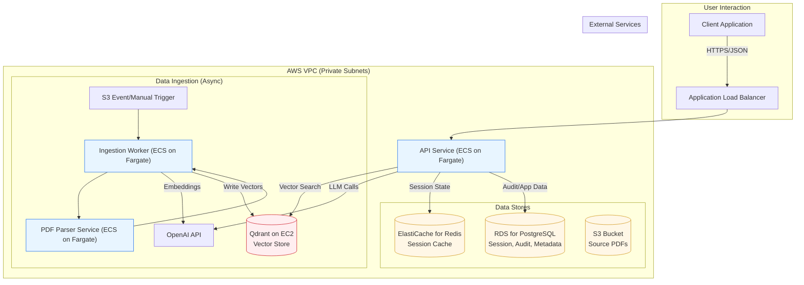

# PLC Coach Service: MVP Architecture & Engineering Plan

**Objective:** This document outlines the proposed technical architecture, technology stack, and DevOps plan for the Minimum Viable Product (MVP) of the PLC Coach service. It is intended for review by senior engineering staff to solicit feedback, identify potential risks, and ensure alignment with best practices before development begins.

**Author:** Vanes
**Date:** February 19, 2026

---

## 1. Project Context & Strategic Vision

The **PLC Coach Service** is a Retrieval-Augmented Generation (RAG) system designed to provide educators with expert, actionable answers grounded in the canonical Professional Learning Communities (PLC) literature. The core business problem is that educators lack the time to efficiently find specific guidance within a large corpus of dense, proprietary books.

The **MVP** is tightly scoped to validate a single hypothesis: that a high-quality, book-only RAG service can provide more utility and accuracy than a general-purpose LLM, thereby establishing a foundation of trust and value with users.

The **long-term vision**, however, is to evolve this service into a comprehensive, multi-tenant coaching platform that securely ingests and processes sensitive educational records, such as PLC meeting transcripts containing student-identifiable information (PII). This forward-looking requirement is the primary driver for the security-first posture and architectural decisions outlined below, even for the book-only MVP.

## 2. Core Compliance Driver: FERPA and State Law Mandates

This architecture is designed to be **compliant by default**. The service will operate as a "school official" under FERPA, which is permissible only with strict contractual and technical controls. Furthermore, the system is designed to meet the stringent requirements of state-level student privacy laws (e.g., NY Ed Law § 2-d, California's SOPIPA), which mandate specific controls beyond FERPA.

Key technical requirements derived from these laws include:

*   **Data Encryption:** All data, including student PII and proprietary book content, must be encrypted both in transit (TLS 1.2+) and at rest (KMS).
*   **Strict Access Control:** A robust Role-Based Access Control (RBAC) system is foundational.
*   **Data Minimization & Purpose Limitation:** The system must only collect, process, and retain data necessary for its specified educational purpose.
*   **Prohibition on Unauthorized Redisclosure:** Data cannot be used for secondary purposes like advertising or building profiles, and it cannot be redisclosed without authorization.
*   **Secure Data Handling:** Any vendor or sub-processor (like OpenAI) must be governed by a Data Processing Agreement (DPA) that contractually enforces these rules.

These compliance obligations dictate a hybrid infrastructure model, favoring self-hosting for critical data-touching components to minimize the compliance surface area.

## 3. Proposed MVP Architecture

The proposed architecture is a hybrid model utilizing AWS managed services for operational efficiency and self-hosted components for security and control. The following diagram illustrates the proposed data flow and component interaction.

### 3.1. Technology Stack & Rationale

| Component | Technology | Hosting Model | Rationale & MVP Scope |
| :--- | :--- | :--- | :--- |
| **Application Framework** | Python 3.11+ with FastAPI & Pydantic | N/A | Modern, high-performance async framework with strong data validation, ideal for API development. |
| **Compute (API & Services)** | Docker Containers on **AWS Fargate** | Managed | Fargate abstracts away server management, simplifying deployments. For MVP, the API, PDF Parser, and Ingestion Worker will run as separate, single-task services for isolation and cost-effectiveness. This can scale to a multi-AZ, auto-scaling configuration post-MVP. |
| **Vector Database** | Qdrant | **Self-Hosted on EC2** | This is the most critical data store from a compliance perspective. Self-hosting on a dedicated EC2 instance within a private VPC ensures the vector embeddings of proprietary content never leave our direct control. For MVP, a single `t4g.medium` or similar instance is sufficient. |
| **PDF Parsing Service** | `llmsherpa/nlm-ingestor` | **Self-Hosted on Fargate** | To prevent sending raw PDF content to any third party, the `llmsherpa` parsing engine will be run as a containerized service within our VPC. The ingestion worker will call this internal service. |
| **Relational Database** | PostgreSQL 15+ | **Amazon RDS** (Managed) | Standard choice for structured data (e.g., session state, audit logs). RDS provides managed backups, patching, and reliability, reducing operational overhead. |
| **Session Cache** | Redis 7+ | **Amazon ElastiCache** (Managed) | Required for managing the state of the two-step conversational clarification loop. ElastiCache is the standard, low-maintenance solution. |
| **File Storage (Corpus)** | N/A | **Amazon S3** (Managed) | Source PDFs will be stored in a private S3 bucket with versioning enabled and access restricted to the ingestion service role. |
| **LLM & Embeddings** | GPT-4o, `text-embedding-3-large` | **OpenAI API** (External) | We will leverage OpenAI's DPA and configure our API usage for zero data retention. This provides state-of-the-art model access while contractually mitigating privacy risks. |

## 4. Key Engineering Deep Dives

### 4.1. The Tenant Enclave Data Model

To prepare for future FERPA requirements, the system's data architecture is built on a "Tenant Enclave" model with three logically segregated data zones. **Only Zone A is implemented in the MVP.**

*   **Zone A: Content Zone:** Stores the PLC book corpus (PDFs, parsed text, embeddings). This is proprietary IP but contains no PII.
*   **Zone B: Meeting/Transcript Zone (Future):** Will store de-identified meeting transcripts. Access will be strictly controlled.
*   **Zone C: Identity/Student Directory Zone (Future):** Will store the mapping between student PII and anonymized tokens. This zone will be the most heavily restricted, accessible only by a dedicated, audited tokenization service.

This proactive data segregation is trivial to define now but would be extremely difficult and risky to retrofit once sensitive data is in the system.

### 4.2. Ingestion Pipeline

The ingestion process is the foundation of the RAG system's quality. It is a multi-step, asynchronous process:

1.  **Trigger:** A new PDF uploaded to the S3 bucket (or a manual trigger) starts an ingestion task on an ECS/Fargate worker.
2.  **Layout-Aware Parsing:** The worker sends the PDF to the internal, self-hosted `llmsherpa` service. This service returns structured content, preserving the hierarchy of headers, paragraphs, lists, and tables.
3.  **Vision for Reproducibles:** The worker identifies landscape-oriented pages (likely worksheets/reproducibles), renders them as images, and uses GPT-4o Vision to generate a structured Markdown description. This is critical for capturing the content of non-textual assets.
4.  **Chunking & Embedding:** The structured text and vision-generated descriptions are chunked. Each chunk is sent to the OpenAI API to generate a `text-embedding-3-large` vector.
5.  **Storage:** The chunk, its vector embedding, and its rich metadata (`book_title`, `authors`, `sku`, `chapter`, `page_number`, `chunk_type`, etc.) are written to the self-hosted Qdrant instance.

### 4.3. Query Engine & API Contract

The query process is designed for high-fidelity, context-aware responses.

1.  **Initial Query:** A user sends a `POST /query` request with their question.
2.  **Clarification Loop:** The API service initiates a session (stored in Redis) and sends the query to GPT-4o with a prompt to generate a clarifying question. This question is returned to the user with a `session_id`.
3.  **Follow-up Query:** The user's client sends a second `POST /query` request containing the `session_id` and the answer to the clarifying question.
4.  **Dynamic Filter Extraction:** The service combines the original query and the clarification, then sends it to GPT-4o with a prompt to extract metadata filters (e.g., `book_title`, `chunk_type`).
5.  **Retrieval:** The service queries Qdrant using the generated filters. If results are sparse (<3), it falls back to an unfiltered query.
6.  **Generation:** The retrieved chunks are passed as context to GPT-4o to synthesize the final answer.
7.  **Response:** The final answer and source citations are returned to the user.

## 5. DevOps & Operations Plan

*   **Infrastructure as Code (IaC):** All AWS resources (VPC, subnets, security groups, IAM roles, Fargate services, RDS, etc.) will be defined using **Terraform**. This ensures the environment is reproducible, version-controlled, and can be easily promoted through dev, staging, and production.
*   **CI/CD:** A **GitHub Actions** workflow will be established. On every push to the `main` branch, the workflow will:
    1.  Run linters and unit tests.
    2.  Build and tag Docker images for the API and service workers.
    3.  Push the images to Amazon ECR (Elastic Container Registry).
    4.  Trigger a new deployment of the relevant ECS/Fargate service.
*   **Networking:** A new VPC will be created with public and private subnets across multiple availability zones. The Application Load Balancer will reside in the public subnets, while all other services (Fargate tasks, RDS, ElastiCache, EC2) will be in the private subnets. A NAT Gateway will provide controlled egress for services that need to call external APIs like OpenAI.
*   **Security & Secrets:** All secrets (API keys, database credentials) will be stored in **AWS Secrets Manager**. IAM roles with least-privilege permissions will be used to grant services access to secrets and other resources. All data will be encrypted at rest using AWS KMS and in transit using TLS.
*   **Observability:** A two-tier logging strategy will be implemented using **Amazon CloudWatch**.
    *   **Audit Logs:** Capture key events (query received, answer generated) with metadata but **no PII or query/answer content**.
    *   **Debug Logs:** Disabled by default in production. Can be temporarily enabled for troubleshooting but will be configured to redact PII.
    *   **AWS X-Ray** will be integrated for distributed tracing to monitor performance and debug issues across services.

## 6. Request for Feedback

We are seeking feedback on all aspects of this plan, with a particular focus on:

*   Are there any unforeseen risks or single points of failure in the proposed MVP architecture?
*   Is the hybrid managed/self-hosted model the appropriate balance of security and operational load for this stage?
*   Are there alternative technologies or AWS services that would better meet our requirements for simplicity, security, and future scalability?
*   Does the DevOps and deployment plan align with current best practices?
